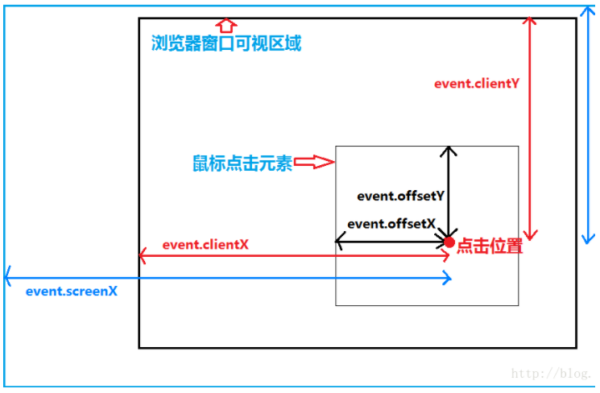

# 位置属性

## 1. window 对象

* window.screenX - 返回浏览器窗口左上角相对于当前屏幕左上角的水平距离
* window.screenLeft - 返回浏览器窗口左上角相对于当前屏幕左上角的水平距离
* window.screenY - 返回浏览器窗口左上角相对于当前屏幕左上角的垂直距离
* window.screenTop - 返回浏览器窗口左上角相对于当前屏幕左上角的垂直距离
* window.innerHeight - 返回网页在当前窗口中可见部分高度，viewport的大小
* window.innerWidth - 返回网页在当前窗口中可见部分宽度，viewport的大小
* window.outerHeight - 返回浏览器窗口的高度，包括浏览器菜单和边框
* window.outerWidth - 返回浏览器窗口的宽度，包括浏览器菜单和边框
* window.scrollX - 同 window.pageXOffset，返回页面的水平滚动距离
* window.scrollY - 同 window.pageYOffset，返回页面的垂直滚动距离

## 2. screen 对象

* screen.height - 浏览器窗口所在的屏幕的高度
* screen.width - 浏览器窗口所在的屏幕的宽度
* screen.availHeight - 浏览器窗口可用的屏幕高度（不包含任务栏）
* screen.availWidth - 浏览器窗口可用的屏幕宽度

## 3. 窗体 document.body

* document.body.clientWidth - 可见区域宽（不包括工具栏、滚动条）
* document.body.clientHeight - 可见区域高（不包括工具栏、滚动条）
* document.documentElement.scrollWidth - 整个网页的宽，包括可视区域和被卷起来区域
* document.documentElement.scrollHeight - 整个网页的宽，包括可视区域和被卷起来区域
* document.body.scrollTop - 整个网页的上方被卷起来的部分
* document.body.scrollLeft - 整个网页的左边被卷起来的部分

## 4. 鼠标事件 event

* e.clientX / e.clientY - （可视区域左上角为参考点）鼠标距离可视窗口左侧边缘的距离，可视区域不包括工具栏和滚动条
* e.pageX / e.pageY - （页面左上角为参考点）鼠标距离网页文档X轴左侧边缘/上侧边缘距离，等于 clientX + scrollLeft
* e.offsetX / e.offsetY - （所在dom左上角为参考点）鼠标指针水平方向上距离当前绑定元素左侧 border 与 padding 分界线之间的距离
* e.sceenX / e.sceenY - （屏幕的左上角为参考点）

## 5. 元素 ele

* ele.clientLeft/Top - 元素左 border 的宽度和上 border 的高度
* ele.clientWidth/Height - 元素 content + padding - 滚动条的宽度或高度\(如果有\)
* ele.offsetWidth/Height - 元素 content + padding + border 的宽度或高度
* ele.scrollLeft/Top - 元素水平、垂直滚动条切去的宽度或高度
* ele.offsetLeft/Top - 当元素的父辈中没有存在 position 属性（除 static），含义就是该元素的 margin 与 borde 之间分界到网页文档左侧之间的距离；当某个元素的父辈中存在 position 属性（除 static），含义就是该元素的 margin 与 borde 之间分界到最近父辈元素border与padding之间分界之间的距离


offsetLeft 和 offsetTop 值的获取跟父级元素没关系，而是跟其上一级的定位元素（除 position:static 外的所有定位）有关系。


## 6.总结\(offset/scroll/client\)

### 6.1 宽高

* offsetWidth = width + padding + border
* offsetHeight = height + padding + border
* scrollWidth = 内容宽度（不包含border）
* scrollHeight = 内容高度（不包含border）
* clientWidth = width + padding
* clientHeight = height + padding

### 6.2 上下

| 内容 | 调用者 | 作用 |
| :--- | :--- | :--- |
| offsetTop/Left | 任意元素\(主要是盒子\) | 距离带有定位父系元素的距离 |
| scrollTop/Left | document.body/window或含有滚动条盒子 | 浏览器无法显示\(或卷去\)的部分 |
| clientY/clientX | event | 鼠标距离浏览器可视区域的距离 |


如果你对内容有任何疑问，欢迎提交 [❕issues](https://github.com/MrEnvision/Front-end_learning_notes/issues) 或 [ ✉️ email](mailto:EnvisionShen@gmail.com)


