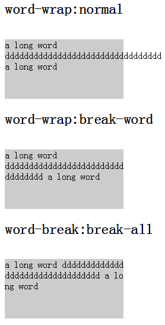
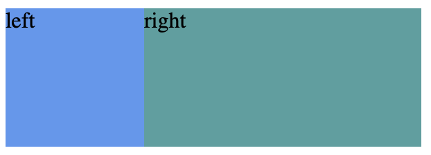

# 进阶知识

## 1. 浏览器兼容性问题

为了让CSS3样式兼容，需要将某些样式加上浏览器前缀：

* -ms- 兼容IE浏览器
* -moz- 兼容firefox
* -o- 兼容opera
* -webkit- 兼容chrome 和 safari

```css
div{ 
    -ms-transform: rotate(30deg); 
    -webkit-transform: rotate(30deg); 
    -o-transform: rotate(30deg); 
    -moz-transform: rotate(30deg); 
    transform: rotate(30deg);
}
```


在实际开发中，我们可以借助[Autoprefixer](https://github.com/postcss/autoprefixer)插件来自动解析CSS文件并且添加浏览器前缀到CSS规则里。


## 2. SASS/SCSS


详见[官方文档](https://sass-lang.com)


## 3. CSS Reset

不同的浏览器对不同的标签都有自己内置的样式设置，这是全局性的样式，不同浏览器之间可能设置还不一样，并且内置的样式可能并不是我们想要的，我们就需要覆盖它，内置样式的存在对兼容性显示产生较大的影响，我们可以借助 CSSReset 来清除浏览器的默认样式。


项目开发初期就要定好 CSSReset，否则在后期更改就比较容易产生问题！此外，在引用的时候要把 CSSReset 引在在第一位 或者 CSSReset的代码要写在最开头。


**常用CSSReset**

* reset.css：[https://meyerweb.com/eric/tools/css/reset/](https://meyerweb.com/eric/tools/css/reset/)
* normalize.css（建议）：[http://necolas.github.io/normalize.css/](http://necolas.github.io/normalize.css/)

## 4. 文本溢出

主要涉及以下几个属性：text-overflow、white-space、word-wrap、word-break。


文本什么时候会发生溢出？

* 设置white-space:nowrap时
* 单个超长字符串


**text-overflow** 用来设置文本溢出时的处理方式。

* clip：直接裁剪掉了
* ellipsis：以省略号...表示
* string：以自定义字符显示\(不建议，存在兼容问题\)


**white-space** 设置如何处理元素内的空白。

* 最常用的是`nowrap`，文本不会换行在同一行上继续，直到遇到 `<br>` 标签为止

**word-wrap** 设置文本行为，当前行发生溢出时是否断开转行；**word-break** 设置文本断字规则。

1）word-wrap取值

* normal：单词太长，换行显示，再超过一行就溢出显示
* break-word：当单词太长时，先尝试换行，换行后还是太长，单词内还可以换行。



2）word-break取值

* normal：单词太长，换行显示，再超过一行就溢出显示
* break-all：强行上，挤不下的话剩下的就换下一行显示
* keep-all：放不下我了，那我就另起一行展示，再放不下，我也不退缩


**单行文本省略号**

```css
overflow:hidden; /* 超出限定的宽度就隐藏内容 */
text-overflow: ellipsis;
white-space: nowrap; /* 设置文字在一行显示不能换行 */
```

**多行文本省略号**

```css
/*多行文本溢出 - webkit内核浏览器*/
p {
  overflow : hidden;
  text-overflow: ellipsis;
  display: -webkit-box; /* 将对象作为弹性伸缩盒子模型显示 */
  -webkit-line-clamp:2; /* 表示最多显示2行 */
  -webkit-box-orient: vertical; /* 设置或检索伸缩盒对象的子元素的排列方式 */
}

/*多行文本溢出 - 其他浏览器*/
p {
  overflow: hidden;
  position: relative;
  line-height: 1.5em;
  height: 3em; /*高度为需要显示的行数×行高*/
}
p:after {
  content: "...";
  position: absolute;
  bottom: 0;
  right: 0;
  background-color: #fff;
}
```

## 5. Web 字体

开发人员可以为自已的网页指定特殊的字体（将指定字体提前下载到站点中），无需考虑用户电脑上是否安装了此特殊字体。


* 参考资料：[MDN Web Docs - web 字体 ](https://developer.mozilla.org/zh-CN/docs/Learn/CSS/Styling_text/Web_fonts)
* 字体网站：[Font Awesome](https://fontawesome.dashgame.com)  [IconFont](https://www.iconfont.cn)  [Icooon](https://icomoon.io)


第一步：使用font-face声明字体

```css
@font-face {
  font-family: 'webfont';
  src: url('webfont.eot'); /* IE9*/
  src: url('webfont.eot?#iefix') format('embedded-opentype'), /* IE6-IE8 */
       url('webfont.woff') format('woff'), /* chrome、firefox */
       url('webfont.ttf') format('truetype'), /* chrome、firefox、opera、Safari, Android, iOS 4.2+*/
       url('webfont.svg#webfont') format('svg'); /* iOS 4.1- */
}
```

第二步：定义使用 webfont 的样式

```css
.web-font {
  font-family:"webfont" !important;
  font-size:16px;font-style:normal;
  -webkit-font-smoothing: antialiased;
  -webkit-text-stroke-width: 0.2px;
  -moz-osx-font-smoothing: grayscale;
}
```

第三步：为文字加上对应的样式

```markup
<div class="web-font">hello</div>
```

## 6. BFC 块级格式化上下文


参考资料：[BFC 介绍](https://www.cnblogs.com/dojo-lzz/p/3999013.html)  [什么是BFC？](https://www.jianshu.com/p/0d713b32cd0d)


### 6.1 作用与特性

1. 使 BFC 内部浮动元素不会到处乱跑，不会产生高度塌陷问题
2. 和浮动元素产生边界
3. 避免margin重叠问题

情况举例1：一般元素设置了浮动或绝对定位，则该元素就会脱离普通文档流，让外层父元素继续包裹住内层元素，则可以将外层父元素设置为BFC，防止高度塌陷。

```markup
<head>
  <style>
    .par{
      border: 2px solid #000000;
      overflow: hidden;
    }
    .chi{
      border: 1px solid #FFF231;
      height: 100px;
      width: 100px;
      float: left;
    }

  </style>
</head>
<body>
  <div class="par">
    <div class="chi">float</div>
  </div>
</body>
```

父元素不加`overflow: hidden;`，则会显示如下：


父元素添加`overflow: hidden;`，则会显示如下：


情况举例2：如果普通元素要与浮动元素产生边距，需要将 maring 设置为浮动元素宽度加上想要产生边距的宽度，而如果将普通元素设置为BFC则能和浮动元素产生边界，避免这个问题。

```markup
<head>
  <style>
    .left{
      background: cornflowerblue;
      height: 100px;
      width: 100px;
      float: left;
    }
    .right{
      background: cadetblue;
      height: 100px;
      width: 200px;
      overflow: hidden;
    }
  </style>
</head>
<body>
  <div class="left">left</div>
  <div class="right">right</div>
</body>
```

右元素不加`overflow: hidden;`，则会显示如下：


右元素添加`overflow: hidden;`，则会显示如下：



### 6.2 形成 BFC

1. 根元素
2. float属性不为none
3. position为absolute或fixed
4. display为inline-block, table-cell, table-caption, flex, inline-flex
5. 具有overflow 且值不是 visible 的块元素


形成 BFC 可以简单理解为脱离文档流（为了记忆方便，实际应该并不是哦！）


## 7. 清除浮动

关键点在于添加清除属性（具体添加在什么上）和触发父元素BFC ，直接设置父元素的高度的方法不考虑。

### 7.1 div + clear

浮动元素后额外使用一个带有`clear:both`属性的空元素，当然也可以对邻接元素添加清除属性。（不建议：额外添加元素，语义化差）

```markup
<div class="parent">
  <div style="float: left;"> child</div>
  <div style="clear: both;"></div>
</div>
```

### 7.2 父元素BFC

BFC 概念，父元素添加`overflow:hidden`等，使父元素变为 BFC 元素，具体详见 [BFC 块级格式化上下文](css-advanced.md#6-bfc-kuai-ji-ge-shi-hua-shang-xia-wen)。（不推荐：可能会产生额外副作用，例如父元素高度比浮动元素小，那么浮动元素超过父元素的部分就无法显示）

```markup
<div style="overflow:hidden;">
  <div style="float: left;"> child</div>
</div>
```

### 7.3 伪元素 + clear

父元素添加 after 伪元素清除浮动（推荐）

```markup
<style>
  .clearfix::after{
    content: '';
    height: 0;
    display: block;
    visibility: hidden;
    clear: both;
  }
</style>

<div class="parent clearfix">
  <div style="float:left;">child</div>
</div>
```

或者 before 和 after 双伪元素清除浮动

```markup
<style>
  .clearfix:after,.clearfix:before{
    content: "";
    display: table;
  }
  .clearfix:after {
    clear: both;   
  }
</style> 

<div class="parent clearfix">
  <div style="float:left;">child</div>
</div>
```

## 8. 重绘与回流


参考资料：[浏览器的回流与重绘 \(Reflow & Repaint\)](https://juejin.cn/post/6844903569087266823)


每个页面至少需要一次回流，就是在页面第一次加载的时候。当 render tree 中的一些元素需要更新属性，浏览器会重新绘制受影响的部分到屏幕中，该过程成为重绘。回流必将引起重绘，重绘不一定会引起回流。

* 重绘：当render tree中一些元素需要更新属性，这些属性只影响外观风格，不影响布局。
* 回流\(也称重排\)：当 render tree 中的部分或全部因为元素的规模尺寸、布局、隐藏等改变而需要重新构建。

### 8.1 回流的场景

* 添加或删除可见的DOM元素
* 元素的位置发生变化
* 元素的尺寸发生变化（包括外边距、内边框、边框大小、高度和宽度等）
* 内容发生变化，比如文本变化或图片被另一个不同尺寸的图片所替代。
* 元素字体大小变化
* 激活CSS伪类（例如：:hover）
* 页面一开始渲染的时候（这肯定避免不了）
* 浏览器的窗口尺寸变化（因为回流是根据视口的大小来计算元素的位置和大小的）
* 获取一些特定属性的值（offsetTop、offsetLeft、 offsetWidth、offsetHeight、scrollTop、scrollLeft、scrollWidth、scrollHeight、clientTop、clientLeft、clientWidth、clientHeight）


需要特别注意最后一个情况，也就是说页面什么都没有改变也可能会产生回流的，这些属性值需要通过**即时计算**得到，浏览器为了获取这些值，也会进行回流。


### 8.2 减少回流和重绘

* 使用cssText，className一次性改变属性

```javascript
const el = document.getElementById('test');
// 原本
el.style.padding = '5px';
el.style.borderLeft = '1px';
el.style.borderRight = '2px';

// 现在合并处理
e1.style.cssText += 'border-left: 1px; border-right: 2px;   padding: 5px;
el.className += ' active'; // 在active的CSS类中定义样式
```

* 对于复杂动画效果,使用绝对定位让其脱离文档流，因为动画经常引起重排，影响周围元素
* 对dom进行一系列修改引起多次回流时候，可以使其脱离文档流（方法见下方），避免影响其他元素
* css3硬件加速（GPU加速）
* 缓存布局信息

```javascript
// 每次都会访问div的offsetLeft，造成浏览器强制刷新渲染队列以获取最新的offsetLeft值
div.style.left = 1 + div.offsetLeft + 'px';

// 缓存该信息进行改进
current = div.offsetLeft;
div.style.left = 1 + ++current + 'px';
```

**脱离文档流的方法：**

隐藏元素，进行修改后，然后再显示该元素（隐藏和显示两次回流）

```javascript
let ul = document.querySelector('#mylist');
ul.style.display = 'none'; // display:none使其脱离文档流
appendNode(ul, data); // 此处进行修改元素
ul.style.display = 'block';
```

使用文档片段\(document fragment\)在当前DOM之外构建一个子树，再把它拷贝回文档

```javascript
const ul = document.getElementById('list');
const fragment = document.createDocumentFragment(); // 创建子树
appendDataToElement(fragment, data);
ul.appendChild(fragment); // 加入到当前文档中
```

将原始元素拷贝到一个独立的节点中，操作这个节点，然后覆盖原始元素

```javascript
let old = document.querySelector('#mylist');
let clone = old.cloneNode(true); // 拷贝到独立的节点
appendNode(clone, data);
old.parentNode.replaceChild(clone, old);
```


如果你对内容有任何疑问，欢迎提交 [❕issues](https://github.com/MrEnvision/Front-end_learning_notes/issues) 或 [ ✉️ email](mailto:EnvisionShen@gmail.com)


