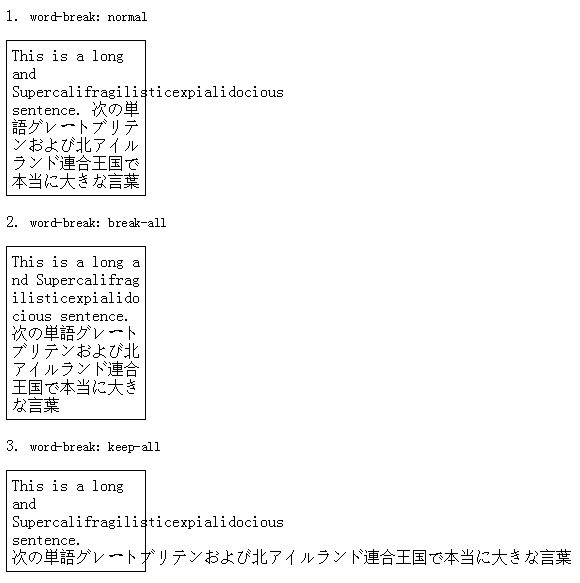

# 进阶知识

## 1. 浏览器兼容性问题

为了让CSS3样式兼容，需要将某些样式加上浏览器前缀：

* -ms- 兼容IE浏览器
* -moz- 兼容firefox
* -o- 兼容opera
* -webkit- 兼容chrome 和 safari

```css
div{ 
    -ms-transform: rotate(30deg); 
    -webkit-transform: rotate(30deg); 
    -o-transform: rotate(30deg); 
    -moz-transform: rotate(30deg); 
    transform: rotate(30deg);
}
```


在实际开发中，我们可以借助[Autoprefixer](https://github.com/postcss/autoprefixer)插件来自动解析CSS文件并且添加浏览器前缀到CSS规则里。


## 2. SASS/SCSS


详见[官方文档](https://sass-lang.com)


## 3. CSS Reset

不同的浏览器对不同的标签都有自己内置的样式设置，这是全局性的样式，不同浏览器之间可能设置还不一样，并且内置的样式可能并不是我们想要的，我们就需要覆盖它，内置样式的存在对兼容性显示产生较大的影响，我们可以借助 CSSReset 来清除浏览器的默认样式。


项目开发初期就要定好 CSSReset，否则在后期更改就比较容易产生问题！此外，在引用的时候要把 CSSReset 引在在第一位 或者 CSSReset的代码要写在最开头。


**常用CSSReset**

* reset.css：[https://meyerweb.com/eric/tools/css/reset/](https://meyerweb.com/eric/tools/css/reset/)
* normalize.css（建议）：[http://necolas.github.io/normalize.css/](http://necolas.github.io/normalize.css/)

## 4. 文本溢出

主要涉及以下几个属性：text-overflow、white-space、word-wrap、word-break。


文本什么时候会发生溢出？

* 设置white-space:nowrap时
* 单个超长字符串


**text-overflow** 用来设置文本溢出时的处理方式。

* clip：直接裁剪掉了
* ellipsis：以省略号...表示
* string：以自定义字符显示\(不建议，存在兼容问题\)


**white-space** 设置如何处理元素内的空白。

* 最常用的是`nowrap`，文本不会换行在同一行上继续，直到遇到 `<br>` 标签为止

**word-wrap** 设置文本行为，当前行发生溢出时是否断开转行；**word-break** 设置文本断字规则。

1）word-wrap取值

* normal：单词太长，换行显示，再超过一行就溢出显示
* break-word：当单词太长时，先尝试换行，换行后还是太长，单词内还可以换行。


2）word-break取值

* normal：单词太长，换行显示，再超过一行就溢出显示
* break-all：强行上，挤不下的话剩下的就换下一行显示
* keep-all：放不下我了，那我就另起一行展示，再放不下，我也不退缩



**单行文本省略号**

```css
overflow:hidden; /* 超出限定的宽度就隐藏内容 */
text-overflow: ellipsis;
white-space: nowrap; /* 设置文字在一行显示不能换行 */
```

**多行文本省略号**

```css
/*多行文本溢出 - webkit内核浏览器*/
p {
  overflow : hidden;
  text-overflow: ellipsis;
  display: -webkit-box; /* 将对象作为弹性伸缩盒子模型显示 */
  -webkit-line-clamp:2; /* 表示最多显示2行 */
  -webkit-box-orient: vertical; /* 设置或检索伸缩盒对象的子元素的排列方式 */
}

/*多行文本溢出 - 其他浏览器*/
p {
  overflow: hidden;
  position: relative;
  line-height: 1.5em;
  height: 3em; /*高度为需要显示的行数×行高*/
}
p:after {
  content: "...";
  position: absolute;
  bottom: 0;
  right: 0;
  background-color: #fff;
}
```

## 5. Web 字体

开发人员可以为自已的网页指定特殊的字体（将指定字体提前下载到站点中），无需考虑用户电脑上是否安装了此特殊字体。


* 参考资料：[MDN Web Docs - web 字体 ](https://developer.mozilla.org/zh-CN/docs/Learn/CSS/Styling_text/Web_fonts)
* 字体网站：[Font Awesome](https://fontawesome.dashgame.com)  [IconFont](https://www.iconfont.cn)  [Icooon](https://icomoon.io)


第一步：使用font-face声明字体

```css
@font-face {
  font-family: 'webfont';
  src: url('webfont.eot'); /* IE9*/
  src: url('webfont.eot?#iefix') format('embedded-opentype'), /* IE6-IE8 */
       url('webfont.woff') format('woff'), /* chrome、firefox */
       url('webfont.ttf') format('truetype'), /* chrome、firefox、opera、Safari, Android, iOS 4.2+*/
       url('webfont.svg#webfont') format('svg'); /* iOS 4.1- */
}
```

第二步：定义使用 webfont 的样式

```css
.web-font {
  font-family:"webfont" !important;
  font-size:16px;font-style:normal;
  -webkit-font-smoothing: antialiased;
  -webkit-text-stroke-width: 0.2px;
  -moz-osx-font-smoothing: grayscale;
}
```

第三步：为文字加上对应的样式

```markup
<div class="web-font">hello</div>
```

## 6. BFC 块级格式化上下文


## 7. 清除浮动


## 8. 重绘与回流



如果你对内容有任何疑问，欢迎提交 [❕issues](https://github.com/MrEnvision/Front-end_learning_notes/issues) 或 [ ✉️ email](mailto:EnvisionShen@gmail.com)


