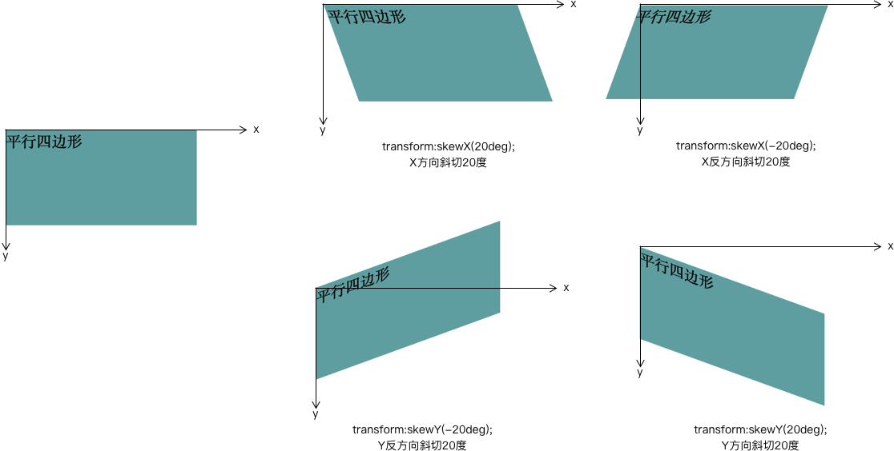

# CSS 画图


参考资料：

* [如何用 CSS 画三角形](https://www.cnblogs.com/wangjiachen666/p/9462837.html)
* [倾斜 skew\(\) 方法](http://www.lvyestudy.com/css3/css3_9.5.aspx)
* [纯 CSS 画的基本图形](https://www.cnblogs.com/zuobaiquan01/p/8582298.html)
* [利用 CSS 样式画各种图形](https://www.cnblogs.com/pigtail/archive/2013/02/17/2914119.html)


## 1. 基于 border 属性

通过对border设置大小，对内容设置宽高/颜色，可以得到梯形、三角形等。


```markup
<body>
  <style>
    div {
      display: inline-block;
      height: 100px;
      width: 100px;
      border-style: solid;
      border-color: red green yellow blue;
    }
    div:nth-child(1) {
      border-width: 90px;
    }
    div:nth-child(2) {
      border-width: 90px;
      border-left-width: 0;
    }
    div:nth-child(3) {
      width: 0;
      border-width: 90px;
    }
    div:nth-child(4) {
      width: 0;
      height: 0;
      border-width: 140px;
    }
    div:nth-child(5) {
      width: 0;
      height: 0;
      border-width: 140px;
      border-right-color: transparent; /*透明*/
    }
  </style>

  <div></div>
  <div></div>
  <div></div>
  <div></div>
  <div></div>
</body>
```

## 2. 基于 skew 属性



## 3. 基于 border-radius 属性


```markup
<body>
  <style>
    div {
      display: inline-block;
      border: 1px solid red;
    }
    div:nth-child(1) {
      height: 100px;
      width: 100px;
      border-radius: 100px;
    }
    div:nth-child(2) {
      height: 100px;
      width: 100px;
      border-radius: 100px 100px 0 0;
    }
    div:nth-child(3) {
      height: 50px;
      width: 100px;
      border-radius: 100px 100px 0 0;
    }
    div:nth-child(4) {
      height: 100px;
      width: 100px;
      border-radius: 50px 0 0 0;
    }
    div:nth-child(5) {
      height: 100px;
      width: 100px;
      border-radius: 100px 0 0 0;
    }
  </style>
  
  <div></div>
  <div></div>
  <div></div>
  <div></div>
  <div></div>
</body>
```

border-radius 可以用来实现圆形，这个众所周知，但是还有一个重要内容是，border-radius 接受水平和垂直方向不同值，使用斜杠\(/\)来分隔它们，这可以让我们在圆角处取整来创建椭圆。


```markup
<body>
  <style>
    div {
      display: inline-block;
      border: 1px solid red;
    }
    div:nth-child(1) {
      height: 50px;
      width: 100px;
      border-radius: 100px / 50px;
    }
    div:nth-child(2) {
      height: 100px;
      width: 50px;
      border-radius: 50px / 100px;
    }
    div:nth-child(3) {
      height: 25px;
      width: 100px;
      border-radius: 50px 50px 0 0 / 25px 25px 0 0;
    }
    div:nth-child(4) {
      height: 100px;
      width: 25px;
      border-radius: 25px 0 0 25px / 50px 0 0 50px;
    }
    div:nth-child(5) {
      height: 50px;
      width: 100px;
      border-radius: 100px 0 0 0 / 50px 0 0 0;
    }
  </style>
  
  <div></div>
  <div></div>
  <div></div>
  <div></div>
  <div></div>
</body>
```

扇形画法是利用 border-radius 并设置透明度来实现的，类似于 CSS 画三角形


```markup
<body>
  <style>
    div {
      display: inline-block;
      height: 0;
      width: 0;
    }
    div:nth-child(1) {
      border: 100px solid red;
      border-radius: 100px;
    }
    div:nth-child(2) {
      border: 100px solid red;
      border-radius: 200px 0 0 0;
    }
    div:nth-child(3) {
      border: 100px solid transparent;
      border-top-color: red;
      border-radius: 100px;
    }
    div:nth-child(4) {
      border: 100px solid transparent;
      border-left-color: red;
      border-top-color: red;
      border-bottom-color: red;
      border-radius: 100px;
    }
  </style>
  
  <div></div>
  <div></div>
  <div></div>
  <div></div>
</body>
```


如果你对内容有任何疑问，欢迎提交 [❕issues](https://github.com/MrEnvision/Front-end_learning_notes/issues) 或 [ ✉️ email](mailto:EnvisionShen@gmail.com)


