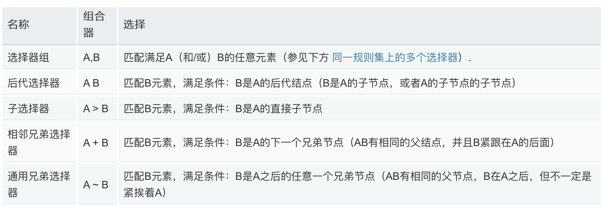

# CSS 选择器


本文内容所涉及的 CSS 选择器包含 CSS3 新增选择器部分，不额外作区分。


* [简单选择器](css-selector.md#1-jian-dan-xuan-ze-qi)：通过元素类型、class 或 id 匹配一个或多个元素 + 通配符`*`
* [属性选择器](css-selector.md#2-shu-xing-xuan-ze-qi)：通过属性或属性值匹配一个或多个元素
* [伪类](css-selector.md#3-wei-lei)：匹配处于确定状态的一个或多个元素
* [伪元素](css-selector.md#4-wei-yuan-su)：匹配处于相关的确定位置的一个或多个元素
* [组合器](css-selector.md#5-zu-he-qi)：以有效的方式组合两个或更多的选择器用于非常特定的选择

## 1. 简单选择器

> 标签选择器、ID 选择器、class 选择器等

```css
p {
  color: red;
}
.first {
  font-weight: bold;
}
#polite {
  font-family: cursive;
}
* {
  padding: 5px;
}
```

## 2. 属性选择器

存在和值（Presence and value）属性选择器：

* \[attr\]：该选择器选择包含 attr 属性的所有元素，不论 attr 的值为何
* \[attr=val\]：该选择器仅选择 attr 属性被赋值为 val 的所有元素
* \[attr~=val\]：该选择器仅选择具有 attr 属性的元素，而且要求 val 值是 attr 值包含的被空格分隔的取值列表里中的一个


= 表示 val 严格等于，～= 表示 val 值包含即可


子串值（Substring value）属性选择器（类似正则表达）

* \[attr\|=val\] : 选择attr属性的值是 val 或值以 val- 开头的元素
* \[attr^=val\] : 选择attr属性的值以 val 开头（包括 val）的元素
* \[attr$=val\] : 选择attr属性的值以 val 结尾（包括 val）的元素
* \[attr\*=val\] : 选择attr属性的值中包含子字符串 val 的元素

```css
/* 给date-pref属性包含same的li标签添加背景颜色 */
li[data-perf*="same"] {
   background-color: rgba(0,0,255,0.5);
}
```

## 3. 伪类


伪类不是选择元素，而是仅在某些特定上下文中存在的元素。


伪类 pseudo-class 是一个以冒号\(:\)作为前缀，被添加到一个选择器末尾的关键字，当你希望样式在特定状态下才被呈现到指定的元素时，你可以往元素的选择器后面加上对应的伪类。

* `:link` 超链接点击之前
* `:visited` 链接被访问过之后
* `:hover` “悬停”，鼠标放到标签上的时候
* `:active` “激活”， 鼠标点击标签，但是不松手时
* `:focus` 是某个标签获得焦点时的样式（比如某个输入框获得焦点）


超链接的书写顺序：a:link 、a:visited 、a:hover 、a:active。

记忆小TIP：“爱恨准则”：love hate，先爱后恨。


* `E:first-child` 匹配父元素的第一个子元素E。
* `E:last-child` 匹配父元素的最后一个子元素E。
* `E:nth-child(n)` 匹配父元素的第n个子元素E。
* `E:nth-child(odd)` 匹配奇数
* `E:nth-child(even)` 匹配偶数
* `E:nth-last-child(n)` 匹配父元素的倒数第n个子元素E。


**注意**，`E:nth-child(n)`中元素的编号是从`1`开始算起，不是从`0`开始算起。

* 如果选择器写成`li:nth-child(2)`，则表示第2个`li`
* 如果选择器写成`li:nth-child(n)`，则表示**所有的**`li`
* 如果选择器写成`li:nth-child(2n)`，则表示所有的**第偶数个**`li`
* 如果选择器写成`li:nth-child(2n+1)`，则表示所有的**第奇数个**`li`
* 如果选择器写成`li:nth-child(-n+5)`，则表示**前5个**`li`
* 如果选择器写成`li:nth-last-child(-n+5)`，则表示**最后5个**`li`
* 如果选择器写成`li:nth-child(7n)`，则表示选中7的倍数


* `E:first-of-type` 匹配同类型中的第一个同级兄弟元素E
* `E:last-of-type` 匹配同类型中的最后一个同级兄弟元素E
* `E:nth-of-type(n)` 匹配同类型中的第n个同级兄弟元素E
* `E:nth-last-of-type(n)` 匹配同类型中的倒数第n个同级兄弟元素E
* `E:empty` 匹配没有任何子节点（包括空格等text节点）的元素E
* `E:target` 匹配相关URL指向的E元素。要配合锚点使用


完整 CSS 伪类详见 [W3school - CSS 选择器参考手册](https://www.w3school.com.cn/cssref/css_selectors.asp)


## 4. 伪元素


伪元素不是选择元素，而是元素的某些部分。


伪元素（Pseudo-element）前缀是两个冒号 \(::\) ， 同样是添加到选择器后面去选择某个元素的某个部分。

* `E::before` 设置在 元素E 前面（依据对象树结构）的内容，常配合 content 属性使用
* `E::after` 设置在 元素E 后面（依据对象树结构）的内容，常配合content属性使用
* `E::first-letter` 设置元素 E 里面的**第一个字符**的样式
* `E::first-line` 设置元素 E 里面的**第一行**的样式
* `E::selection` 设置元素 E 里面被鼠标选中的区域的样式（一般设置颜色和背景色）

## 5. 组合器



```css
/* 所有table里的tfoot里的th */
table tfoot th {}
/* 在table当中，所有的th之后的td */
table th + td {}
/* 所有table里的tbody里的所有td（第一个除外），每个td都是由它上边的td选择 */
table tbody td + td {}
```


如果你对内容有任何疑问，欢迎提交 [❕issues](https://github.com/MrEnvision/Front-end_learning_notes/issues) 或 [ ✉️ email](mailto:EnvisionShen@gmail.com)


