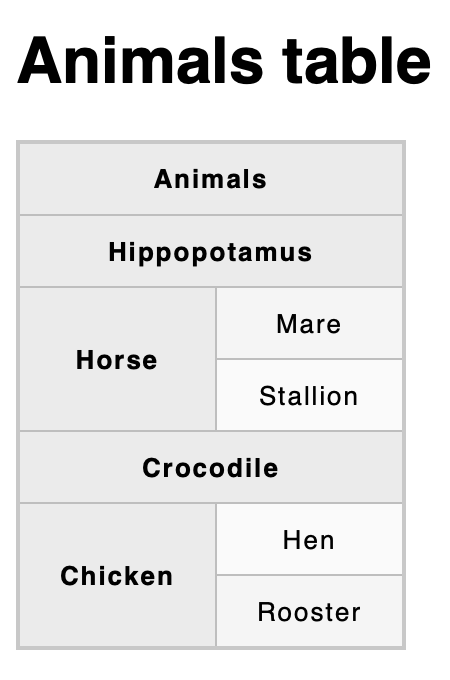
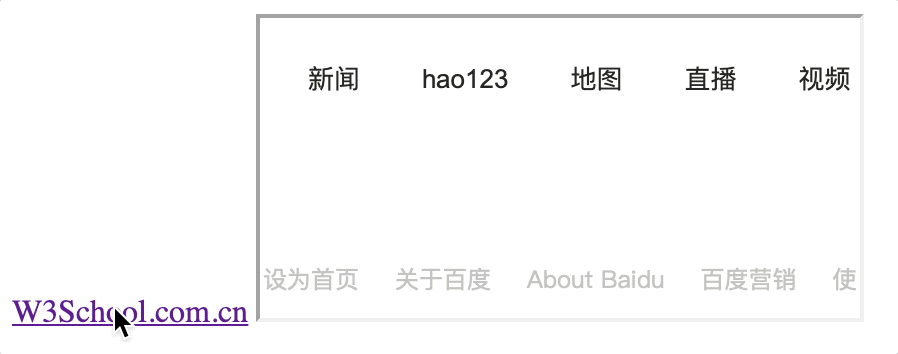
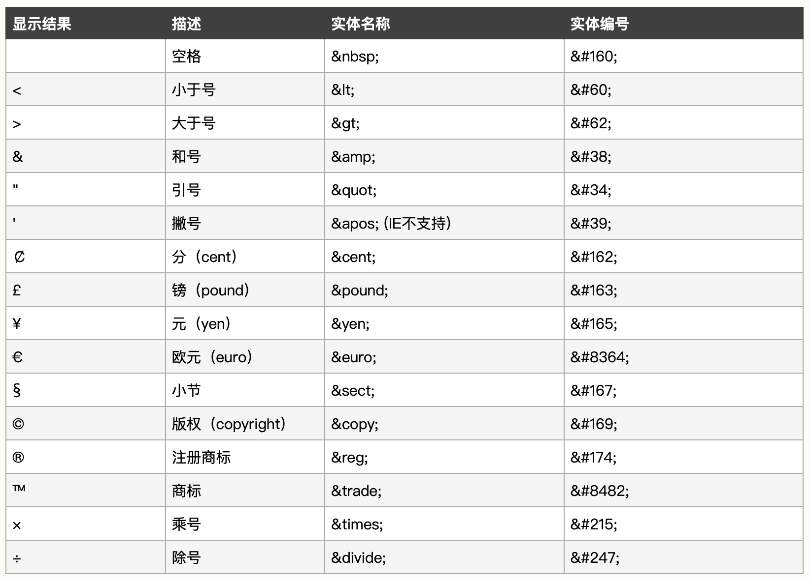

# 基础知识

> HTML（HyperText Markup Language）：超文本标记语言，从**语义**角度描述页面的**结构**。

## 1. 基础结构

```markup
<!-- 文档声明头 -->
<!DOCTYPE html>
<!-- 根标签 -->
<html lang="en">
<!-- 头标签 -->
<head>
    <!-- 网页的编码方式 -->
    <meta charset="UTF-8">
    <meta http-equiv="X-UA-Compatible" content="IE=edge">
    <!-- 视口设置 -->
    <meta name="viewport" content="width=device-width, initial-scale=1.0">
    <!-- 页面上的所有链接规定默认地址或默认目标(target) -->
    <base href="http://www.fourdays.com" />
    <!-- 文档标题 -->
    <title>Document</title>
</head>
<!-- 文档主体 -->
<body>
</body>
</html>
```

html 的常见元素主要分为两类：head 区域的元素、body 区域的元素。

* **head 区域的元素**：[meta](html-advanced.md#yuan-biao-qian)，title，style，link，script，base 等；
* **body 区域的元素**：详见 [HTML标签](html-basic.md#2-html-biao-qian)。

## 2. HTML 标签


参考链接：[W3school HTML 标签参考手册](https://www.w3school.com.cn/tags/html_ref_byfunc.asp)


第一种分类：

* **文本级标签**：文本级标签里只能放**文字、图片、表单元素**，主要有 p、span、a、b、i、u、em 等；
* **容器级标签**：容器级标签里可以放置任何东西，主要有 div、h1、li、dt、dd 等。

第二种分类

* **block 块元素**：块元素以新行来开始和结束，主要有 div、h1、p、ul、table 等；
* **inline 行内元素**：行内元素不以新行来开始和结束，主要有 img、span、b、a、td 等；
* **inline-block 元素**：对外的表现是行内元素，对内的表现是块级元素。

| 块元素 | 行内元素 |
| :--- | :--- |
| 块级元素宽度在不设置的情况下，是它本身父容器的100%（和父元素的宽度一致），除非设定一个宽度。 | 行内元素的宽度就是它包含的文字或图片的宽度，不可改变。 |
| 块级元素的高度、宽度、行高以及顶和底边距都可设置。 | 内联元素的高度、宽度及顶部和底部边距不可设置。 |

### 2.1 排版标签


div 是最常见的元素，大多数场景下都可以用div，这也导致 div 的语义并不是很明确，因此除了 div+css 布局之外，H5 中引入了更加明确语义的标签页面布局，例如 header、footer、nav、section 等，具体详见 [HTML5](html5.md)。


基础标签

```markup
<!-- 标题标签 -->
<h1></h1>
<h2></h2>
<h3></h3>
<h4></h4>
<h5></h5>
<h6></h6>
<!-- 段落标签 -->
<p>This is a paragraph</p>
<!-- 水平线标签 -->
<hr />
<!-- 换行标签 -->
<br />
```

格式化标签

```markup
<!-- 定义计算机代码（表示计算机源代码，不保留多余的空格和折行） -->
<code></code>
<!-- 定义预格式文本（编辑器的格式就是显示的格式，保留多余的空格和折行） -->
<pre></pre>

<!-- 定义粗体文本 -->
<b></b>
<!-- 定义强调文字 -->
<em></em>
<!-- 定义斜体字 -->
<i></i>
<!-- 定义小号字 -->
<small></small>
<!-- 定义加重语气 -->
<strong></strong>
<!-- 定义下标字 -->
<sub></sub>
<!-- 定义上标字 -->
<sup></sup>
<!-- 定义插入字 -->
<ins></ins>
<!-- 定义删除线 -->
<del></del>
<!-- 定义下划线 -->
<u></u>

<!-- 定义短引用（显示带“”） -->
<q></q>
<!-- 定义首字母缩写（显示会缩进） -->
<blockquote></blockquote>
<!-- 定义缩写(例如WHO)  -->
<abbr></abbr>
<!-- 定义地址联系方式(显示为斜体)  -->
<address></address>
<!-- 定义著作标题 -->
 <cite></cite>
```

### 2.2 超链接

`<a>`标签属性：

* `href`：目标URL
* `title`：悬停文本
* `name`：主要用于设置一个锚点的名称。
* `target`：告诉浏览器用什么方式来打开目标页面。`target`属性有以下几个值：
  * `_self`：在同一个网页中显示（默认值）
  * `_blank`：**在新的窗口中打开**。
  * `_parent`：在父窗口中显示
  * `_top`：在顶级窗口中显示

#### 外部链接

```markup
<a href="http://www.baidu.com" target="_blank">Link Text</a>
```

#### 锚链接

```markup
<!-- 使用 id 属性进行链接，任意标签均有效 -->
<div id="top"></div>
<a href="#top">回到顶部</a>

<!--  a标签使用 name 属性作锚点，适用于 a 标签 -->
<a name='backTop'></a>
<a href="#backTop">回到顶部</a>

<!-- 其他页面也可定位至某个锚 -->
<a href="http://www.fourdays.top#tips">定位至fourdays页面的锚tips</a>
```


若浏览器找不到已定义的命名锚，那么就会定位到文档的顶端。


#### 邮件链接

```markup
<a href="mailto:nowhere@mozilla.org">Send email to nowhere</a>
<!-- 邮件连接 - 任何标准的邮件头字段都可以被添加到邮件URL中 -->
<a href="mailto:邮件地址?cc=抄送地址1&bcc=暗抄送地址&subject=主题&body=主体">Send mail with cc, bcc, subject and body</a>
```


知识点：区别 href 与 src

* href 用于在当前文档和引用资源之间确立联系，例如 a 标签、link 标签等；
* src 用于替换当前内，例如 img 标签、script 标签等。


### 2.3 图片标签

```markup
<!-- src为图片地址，alt为图片未显示时的替换文本, title为鼠标悬停时出现的文本 -->

```


知识点：相对路径和绝对路径。

* 相对路径：相对当前页面所在的路径，`.`和`..`代表当前目录和上一层目录；
* 绝对路径：主要分为盘路径和网络路径
  * 以盘符开始的绝对路径，例如 C:\Users\html\images\1.jpg
  * 网络路径，例如 http://img.smyhvae.com/img.png



绝对不允许使用`file://`开头的文件，这个是完全错误的！


图片添加说明文字，建议舍弃使用``与`<p></p>`组合，采用`<figure>` 和 `<figcaption>`，建立图片与标题之间的语义。

```markup
<!-- 注意：figure可以是几张图片、一段代码、音视频、方程、表格或别的 -->
<figure>
  
  <figcaption>一只霸王龙的化石</figcaption>
</figure>
```

图片定位链接可在图片不同位置跳转至不同链接，具体详见[进阶知识-图像区域映射](html-advanced.md#3-tu-xiang-qu-yu-ying-she)。

```markup
<!-- usemap 属性与 name 一致 -->

<map name="mymap">
    <area shape="rect" coords="0,0,50,50" href="url1" /> 
    <area shape="circle" coords="75,75,25" href="url2" /> 
</map>
```

### 2.4 列表标签

无序列表

```markup
<ul>
    <li type="disc">实心原点（默认）</li>
    <li type="square">实心方点</li>
    <li type="circle">空心圆</li>
</ul>
```

有序列表

```markup
<ol>
     <li type="1" start="4">默认</li>
     <li type="a" start="5"></li>
     <li type="A"></li>
     <li type="i"></li>
     <li type="I"></li>
</ol>
```

定义列表

```markup
<dl>
  <!-- <dt>：definition title 列表的标题，这个标签是必须的 -->
	<dt>购物指南</dt>
	<!-- <dd>：definition description 列表的列表项，这个标签是可选项 -->
	<dd><a href="#">购物流程</a></dd>
	<dd><a href="#">会员介绍</a></dd>
	<dd><a href="#">生活旅行/团购</a></dd>
	<dd><a href="#">常见问题</a></dd>
</dl>
<dl>
	<dt>配送方式</dt>
	<dd>
		<a href="#">上门自提</a>
		<a href="#">211限时达</a>
		<a href="#">配送服务查询</a>
		<a href="#">配送费收取标准</a>
		<a href="#">海外配送</a>
	</dd>
</dl>
```


### 2.5 表格标签

基本结构

```markup
<table>
    <!-- 标题 -->
    <caption></caption>
    <!-- 表头 -->
    <thread>
      <tr>
        <th></th>
        <th></th>
      </tr>
    </thread>
    <!-- 内容 -->
    <tbody>
      <tr>
        <td></td>
        <td></td>
      </tr>
    </tbody>
    <!-- 表尾 -->
    <tfoot></tfoot>
  </table>
```

单元格合并

* `colspan`：横向合并，例如`colspan="2"`表示当前单元格在水平方向上要占据两个单元格的位置。
* `rowspan`：纵向合并，例如`rowspan="2"`表示当前单元格在垂直方向上要占据两个单元格的位置。

```markup
<table>
    <tr>
      <th colspan="2">Animals</th>
    </tr>
    <tr>
      <th colspan="2">Hippopotamus</th>
    </tr>
    <tr>
      <th rowspan="2">Horse</th>
      <td>Mare</td>
    </tr>
    <tr>
      <td>Stallion</td>
    </tr>
    <tr>
      <th colspan="2">Crocodile</th>
    </tr>
    <tr>
      <th rowspan="2">Chicken</th>
      <td>Hen</td>
    </tr>
    <tr>
      <td>Rooster</td>
    </tr>
  </table>
```



### 2.6 框架标签

在网页内显示网页：

```markup
<iframe src="targetURL"></iframe>
```

iframe作为链接的目标，点击链接iframe显示链接的内容，通过name属性实现：

```markup
<a href="http://www.w3school.com.cn" target="iframe_a">W3School.com.cn</a>
<iframe src="http://wwww.baidu.com" name="iframe_a"></iframe>
```



### 2.7 表单标签

表单标签用`<form>`表示，用于与服务器的交互。

**属性**

* `name`：表单的名称，用于JS来操作或控制表单时使用；
* `id`：表单的名称，用于JS来操作或控制表单时使用；
* `action`：指定表单数据的处理程序，一般是PHP，如：action=“login.php”；
* `method`：表单数据的HTTP提交方式，一般是get\(默认\)和post。
* `enctype`属性：内容发送编码


知识点：编码格式

* application/x-www-form-urlencoded（默认），key=value&key=value 格式
* multipart/form-data，提交文件时需要设置
* text/plain，纯文本


```markup
<form action="/my-handling-form-page" method="post">
  <div>
    <!-- label 标签的 for 可以与 input 标签的 id 相互绑定，这样就允许用户单击标签以激活相应的小部件 -->
    <label for="name">Name:</label>
    <input type="text" id="name" name="user_name" />
  </div>
  <div>
    <label for="mail">E-mail:</label>
    <input type="email" id="mail" name="user_email" />
  </div>
  <div>
    <label for="msg">Message:</label>
    <textarea id="msg" name="user_message"></textarea>
  </div>
  <div class="button">
    <button type="submit">Send your message</button>
  </div>
</form>
```

表单语义化

* fieldset 元素是用于创建具有相同目的的小部件组的方式，出于样式和语义目的； 
* legend 元素来给 fieldset 标上标签，其文本内容正式地描述 fieldset 的用途。

```markup
<form>

    <fieldset>
      <legend>账户信息</legend>
      姓名：<input value="name">
      密码：<input type="password" value="pwd" size="50">
    </fieldset>  
     
    <fieldset>
      <legend>其他信息</legend>
      性别：<input value="gender">
      爱好：<input value="love">
    </fieldset>
  </form>
```

基础组件


完整表单组件详见 [W3school HTML 标签参考手册](https://www.w3school.com.cn/tags/html_ref_byfunc.asp)


```markup
<form>
    <!-- 单行文本域 -->
    <input type="text" id="comment" name="comment" value="I'm a text field" />
    <!-- 多行文本域 -->
    <textarea rows="行数" cols="列数"></textarea>
    <!-- Email - multiple属性表示允许输入多个电子邮件地址(以逗号分隔) -->
    <input type="email" id="email" name="email" multiple />
    <!-- 密码 -->
    <input type="password" id="pwd" name="pwd" />
    <!-- 搜索域 -->
    <input type="search" id="search" name="search" />
    <!-- 电话号码域 -->
    <input type="tel" id="tel" name="tel" />
    <!-- URL域 -->
    <input type="url" id="url" name="url" />
    <!-- 数字 -->
    <input type="number" name="age" id="age" min="1" max="10" step="2" />
    <!-- 滑块 -->
    <input type="range" name="beans" id="beans" min="0" max="500" step="10" />

    <!-- 日期时间选择器，type分为date、datetime-local、month、time、week -->
    <input type="datetime-local" name="datetime" id="datetime" />
    <input
      type="date"
      name="myDate"
      min="2013-06-01"
      max="2013-08-31"
      id="myDate"
    />

    <!-- 自动补全输入框 -->
    <label for="myFruit">What's your favorite fruit?</label>
    <input type="text" name="myFruit" id="myFruit" list="mySuggestion" />
    <datalist id="mySuggestion">
      <option>Apple</option>
      <option>Banana</option>
      <option>Blackberry</option>
      <option>Blueberry</option>
      <option>Lemon</option>
      <option>Lychee</option>
      <option>Peach</option>
      <option>Pear</option>
    </datalist>

    <!-- 按钮 -->
    <button></button>
    <input type="reset" value="重置（按钮上显示文字）" />
    <input type="submit" value="提交（按钮上显示文字）" />

    <!-- 单选按钮，name属性共享相同的值，那么它们将被认为属于同一组的按钮，同一组中只有一个按钮可以同时被选 -->
    <input
      type="radio"
      id="sp_type"
      name="p_type"
      value="single"
      checked="checked"
    />
    <input
      type="radio"
      id="dp_type"
      name="p_type"
      value="some"
      style="width: 10px"
    />
    <input
      type="radio"
      id="fp_type"
      name="p_type"
      value="family"
      style="width: 10px"
    />

    <!-- 复选按钮 -->
    <input
      type="checkbox"
      id="carrots"
      name="carrots"
      value="carrots"
      checked
    />
    <input type="checkbox" id="carrots" name="carrots" value="family" />
    <input type="checkbox" id="carrots" name="carrots" value="single" />

    <!-- 选择框-下拉框 -->
    <select id="simple" name="simple">
      <option value="提交值">Banana</option>
      <option value="提交值">Cherry</option>
      <option value="提交值" selected="selected">Lemon</option>
    </select>

    <!-- 选择框利用 optgroup 将选项进行分组 -->
    <select id="groups" name="groups">
      <optgroup label="fruits">
        <option>Banana</option>
        <option selected>Cherry</option>
        <option>Lemon</option>
      </optgroup>
      <optgroup label="vegetables">
        <option>Carrot</option>
        <option>Eggplant</option>
        <option>Potato</option>
      </optgroup>
    </select>

    <!-- 多选选择框 - 使用multiple -->
    <select multiple id="multi" name="multi">
      <option>Banana</option>
      <option>Cherry</option>
      <option>Lemon</option>
    </select>
  </form>
```

### 2.8 多媒体标签


video 和 audio 是 [HTML5](html5.md#shi-yin-pin) 中引入的。


视频 `<video>` 标签

```markup
<!-- video 标签内的段落，当不支持video时则会显示 -->
<video src="地址" controls>
    <p>你的浏览器不支持 HTML5 视频。可点击<a href="地址">此链接</a>观看</p>
</video>

<!-- 当需要适配不同浏览器对不同格式视频的支持情况时 -->
<video controls>
  <source src="rabbit320.mp4" type="video/mp4">
  <source src="rabbit320.webm" type="video/webm">
  <p>你的浏览器不支持 HTML5 视频。可点击<a href="rabbit320.mp4">此链接</a>观看</p>
</video>
```

音频 `audio` 标签

```markup
<audio src="输入文件地址" controls>
    浏览器不支持(浏览器不支持的时候显示)
</audio>

<!-- 多文件供浏览器支持 -->
<audio controls>
    <source src="输入文件地址">
    <source src="输入文件地址">
</audio>
```

### 2.9 实体字符




如果你对内容有任何疑问，欢迎提交 [❕issues](https://github.com/MrEnvision/Front-end_learning_notes/issues) 或 [ ✉️ email](mailto:EnvisionShen@gmail.com)


