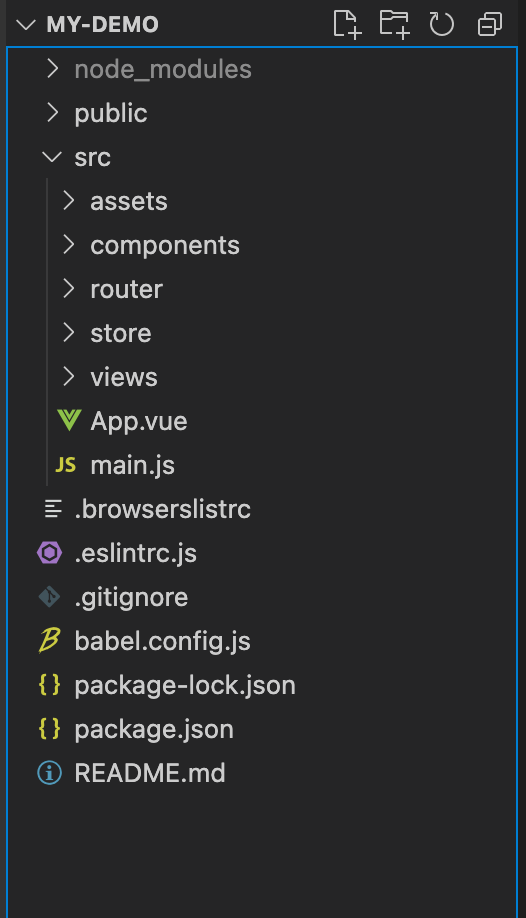

# 基础知识

> 本文主要基于 Vue2.0 进行总结，不涉及 Vue3.0 知识。


参考资料：[Vue 官网](https://cn.vuejs.org)（框架最好的学习途径就是官网）


## 1. 创建项目

如果未安装 vue-cil，则先全局安装 vue-cli

```text
$ npm install -g @vue/cli
```

基于 vue-cil 创建项目

```text
$ vue create my-demo
$ cd my-app
$ npm run serve
```



## 2. 指令

> 指令的职责是，当表达式的值改变时，将其产生的连带影响，响应式地作用于 DOM。

（1）数据绑定

* `v-text`
* `v-html`


`v-text`与`v-html`的区别？

`v-text`是纯文本，而`v-html`会被解析成 html 元素。



`v-text`与`{{}}`的区别？

* `v-text`网络很慢的情况下没有闪烁的问题，因为它是放在属性里的；
* `{{}}`只替换自己的占位符，并不会把整个元素内容清空，`v-text`会覆盖元素中原本的内容。


（2）绑定机制

* `v-bind:属性名`：简写`:属性名`，用于绑定属性
* `v-on:事件名`：简写`@事件名`，用于绑定事件
  * v-on:click
  * v-on:keydown
  * v-on:keyup
  * v-on:mousedown
  * v-on:mouseover
  * v-on:submit
  * ....

（3）条件渲染

* `v-if`
* `v-else-if`
* `v-else`
* `v-show`


v-if 和 v-show 的区别？

区别：v-show 只是单纯切换元素的 CSS 属性 display，带有 v-show 的元素始终会被渲染并保留在 DOM 中，而 v-if 则决定了元素是否在 Dom树中。

* 如果元素涉及到频繁的切换，最好不要使用 v-if, 而是推荐使用 v-show
* 如果元素可能永远也不会被显示出来被用户看到，则推荐使用 v-if


（4）表单绑定

* `v-model`：双向数据绑定，只能用于表单元素，或者用于自定义组件

（5）列表渲染

* `v-for`：根据数组中的元素遍历指定模板内容生成内容


列表渲染时必须绑定一个 key 属性，从而能够跟踪每个节点的身份，例如`<div v-for="item in items" v-bind:key="item.id">，`key的类型只能是string/number，而且要通过 v-bind 来指定。


## 3. class 绑定

```javascript
// vue的data数据如下
data: {
  isActive: true,
  hasError: false,
  activeClass: 'active',
  errorClass: 'error',
  classObject: {
    active: true,
    error: false
  }
}
```

```markup
<!-- 对象方式-1 -->
<div v-bind:class="{ active: isActive }"></div>
<div class="active"></div>
​
<!-- 对象方式-2 -->
<div v-bind:class="classObject"></div>
<div class="active"></div>

<!-- 数组方式 -->​
<div v-bind:class="[activeClass, errorClass]"></div>
<div class="active error"></div>

​<!-- 数组中有对象和三元组 -->
<div v-bind:class="[errorClass, { active: isActive }, isActive ? 'active' : '']"></div>
<div class="active error"></div
```

## 4. 事件修饰符

`v-on` 提供了很多事件修饰符来辅助实现一些功能。事件修饰符有如下：

* `.stop` 阻止冒泡。本质是调用 event.stopPropagation\(\)。
* `.prevent` 阻止默认事件（默认行为）。本质是调用 event.preventDefault\(\)。
* `.capture` 添加事件监听器时，使用捕获的方式，而不是采用冒泡的方式。
* `.self` 只有当事件在该元素本身（比如不是子元素）触发时，才会触发回调。
* `.once` 事件只触发一次。
* `.{keyCode | keyAlias}` 只当事件是从侦听器绑定的元素本身触发时，才触发回调。
* `.native` 监听组件根元素的原生事件。

```markup
 <button @click.stop="doThis"></button>
```

## 5. 过滤器

Vue.js 允许我们自定义过滤器，可被用作一些常见的文本格式化。

```markup
<div>{{ msg | formateMsg }}</div>
<script>
export default {
  filters: {
    formateMsg: val => {
      return `hello,${msg}`
    }
  }
}
</script>
```

## 6. 组件

组件的出现，就是为了拆分Vue实例的代码量的，能够让我们以不同的组件，来划分不同的功能模块，将来我们需要什么样的功能，就可以去调用对应的组件即可。

* 模块化：是从代码逻辑的角度进行划分的，代码分层开发，每个功能模块的职能单一
* 组件化：是从UI界面的角度进行划分的，前端的组件化，方便UI组件的重用

全局注册：一般在`main.js`文件中进行注册，然后在所有地方都可以使用

```javascript
Vue.component('my-component-name', {
  // ... 选项 ...
})
```

局部注册：哪里用哪里注册

```javascript
new Vue({
  el: '#app',
  components: {
    'component-a': ComponentA,
    'component-b': ComponentB
  }
})
```



## 7. Vue 动画



## 8. Vue 路由


基于 [Vue-Router](https://router.vuejs.org/zh/) 进行路由管理。


前端路由：对于单页面应用程序来说，主要通过URL中的`hash`（url地址中的\#号）来实现不同页面之间的切换，称作前端路由。

## 9. 生命周期


* beforeCreate：在data初始化、event配置前调用
* created：data对象及其事件完全初始化，但是dom树未挂载
* beforeMount：在挂载dom树之前调用，即更改已完成，但尚未准备好更新dom
* mounted：挂载已完成，dom树被渲染到页面，可进行dom操作
* beforeUpdate：数据有更新时调用
* update：虚拟dom重新渲染补丁以最小开支渲染dom
* beforeDestroy：实例销毁之前调用
* destroy：组建销毁之后调用


获得 data 和 method 最早在 created；操作 Dom 节点最早在 mounted。


## 10. MVVM 原理

MVVM（Model-View-ViewModel）中 Model 用 JS 对象表示，而 View 就是显示的 UI 界面，ViewModel 就负责把 View 和 Model 关联起来，其将 model 的数据改变同步显示到 View 中，并将 View 的修改同步回 Model。通过 MVVM 我们只需要关注 Model 中的 JS 对象的变化即可，MVVM 会自动更新 DOM 的状态显示，避免了操作 DOM 的繁琐步骤。

```javascript
// 如下所示person为一个model，视图中绑定person.name，我们更新视图只需要修改person.name即可。
var person = {
    name: 'Bart',
    age: 12
};

person.name = 'envision'; // 自动更新视图
```

**Vue 实现原理**


参考资料：[剖析Vue原理&实现双向绑定MVVM](https://segmentfault.com/a/1190000006599500)   [MVVM中双向数据绑定的基本原理](https://www.cnblogs.com/dashnowords/p/9955460.html)


采用数据劫持结合发布者-订阅者模式的方式，通过`Object.defineProperty()`来劫持各个属性的`setter`和`getter`，在数据变动时发布消息给订阅者，触发相应的监听回调，而产生更新数据和视图。

1. 实现一个监听器Observer，用来劫持并监听所有属性，如果有变动的，就拿到最新值并通知订阅者。
2. 实现一个Watcher，作为连接Observer和Compile的桥梁，能够订阅并收到每个属性变动的通知，执行指令绑定的相应回调函数，从而更新视图。
3. 实现一个解析器Compile，可以扫描和解析每个节点的相关指令，并根据初始化模板替换数据，以及绑定相应的更新函数。


当执行 new Vue\(\) 时，Vue 就进入了初始化阶段，一方面 Vue 会遍历 data 选项中的属性，并用 Object.defineProperty 将它们转为 getter/setter，实现数据变化监听功能；另一方面，Vue 的指令编译器 Compile 对元素节点的指令进行解析，初始化视图，并订阅 Watcher 来更新视图， 此时 Wather 会将自己添加到消息订阅器中\(Dep\)，初始化完毕。当数据发生变化时，Observer 中的 setter 方法被触发，setter 会立即调用 Dep.notify\(\)，Dep 开始遍历所有的订阅者，并调用订阅者的 update 方法，订阅者收到通知后对视图进行相应的更新。

## 11. 踩坑指南



## 12. 代码规范


如果你对内容有任何疑问，欢迎提交 [❕issues](https://github.com/MrEnvision/Front-end_learning_notes/issues) 或 [ ✉️ email](mailto:EnvisionShen@gmail.com)


