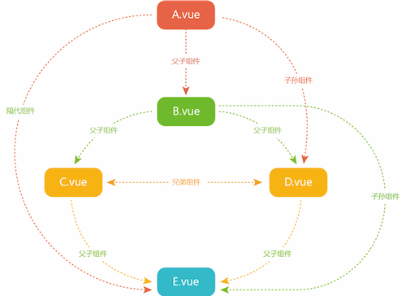

# 组件通信


参考链接：[Vue 组件通讯](https://github.com/MrEnvision/Front-end_learning_project/tree/master/vue_components_communication)  [Vue 通信六种方式 ](https://segmentfault.com/a/1190000019208626)




* 父子组件：A与B、B与C、B与D、C与E、D与E
* 子孙组件：A与D、B与E
* 兄弟组件：C与D
* 隔代组件：A与E

## 1. props / emit

父组件向子组件传值：props

```markup
<!-- 父组件 -->
<template>
  <child :msg='myMsg'></child>
</template>
<script>
import Child from "./components/Child"
export default {
  components:{ Child },
  data(){
    return{
      myMsg: 'hello child'
    }
  }
}
</script>

<!-- 子组件 -->
<template>
  <div>{{ myMsg }}</div>
</template>
<script>
export default {
  props: {
    myMsg: { // hello child
      type: String,
      default: ''
    }
  }
}
</script>
```

子组件向父组件传值：绑定事件 + emit

```markup
<!-- 父组件 -->
<template>
  <child @getMsg='updateMsg'></child>
</template>
<script>
import Child from "./components/Child"
export default {
  components:{ Child },
  methods: {
    updateMsg: (val) => {
      console.log(val) // hello parent
    }
  }
}
</script>

<!-- 子组件 -->
<template>
  <button @click='onClick'>点击</button>
</template>
<script>
export default {
  methods: {
    onClick: () => {
      this.$emit('getMsg', 'hello parent')
    }
  }
}
</script>
```

通过 sync 使得子组件更新父组件属性

```markup
<!-- 父组件 -->
<template>
  <child :msg.sync='myMsg'></child>
</template>
<script>
import Child from "./components/Child"
export default {
  components:{ Child },
  data(){
    return{
      myMsg: 'hello child'
    }
  }
}
</script>

<!-- 子组件 -->
<template>
  <button @click='onClick'>点击</button>
</template>
<script>
export default {
  methods: {
    onClick: () => {
      this.$emit('update:myMsg', 'hello parent')
    }
  }
}
</script>
```

## 2. Vuex


这是最常用的方式，具体详见[官方文档](https://vuex.vuejs.org/zh/)和[项目工程](https://github.com/MrEnvision/Front-end_learning_project/tree/master/vuex_tutorial)。



## 3. 中央事件总线 Bus

```javascript
// bus.js - 创建实例
import Vue from 'vue';
export default new Vue();
```

```javascript
// 注册事件
import Bus from 'bus.js'
Bus.$on('getTarget', target => {  
    console.log(target);  
});
```

```javascript
// 调用事件
import Bus from 'bus.js'
Bus.$emit('getTarget', 'hello world!');
```

## 4. provide / inject

```javascript
// 祖先组件
export default {
  provide: {
    name: '浪里行舟'
  }
}
```

```javascript
// 子孙组件
export default {
  inject: ['name'], // 注入后通过this.XXX使用
  mounted () {
    console.log(this.name);  // 浪里行舟
  }
}
```

## 5. $attrs / $listeners

详见参考资料。

## 6. $ref / $parent / $children

* `ref`：在子组件上使用时引用就指向组件实例，`this.$ref.名字`即可获取子组件实例
* `$parent` / `$children`：访问父 / 子实例

## 总结

* 父子通信：
  * props / emit
  * $ref / $parent / $children
  * provide / inject API
  * ....（上述方法均可）
* 兄弟通信
  * Vuex
  * 中央事件总线 Bus
* 跨级通信
  * Vuex；
  * 中央事件总线 Bus
  * provide / inject API
  * $attrs / $listeners


如果你对内容有任何疑问，欢迎提交 [❕issues](https://github.com/MrEnvision/Front-end_learning_notes/issues) 或 [ ✉️ email](mailto:EnvisionShen@gmail.com)


